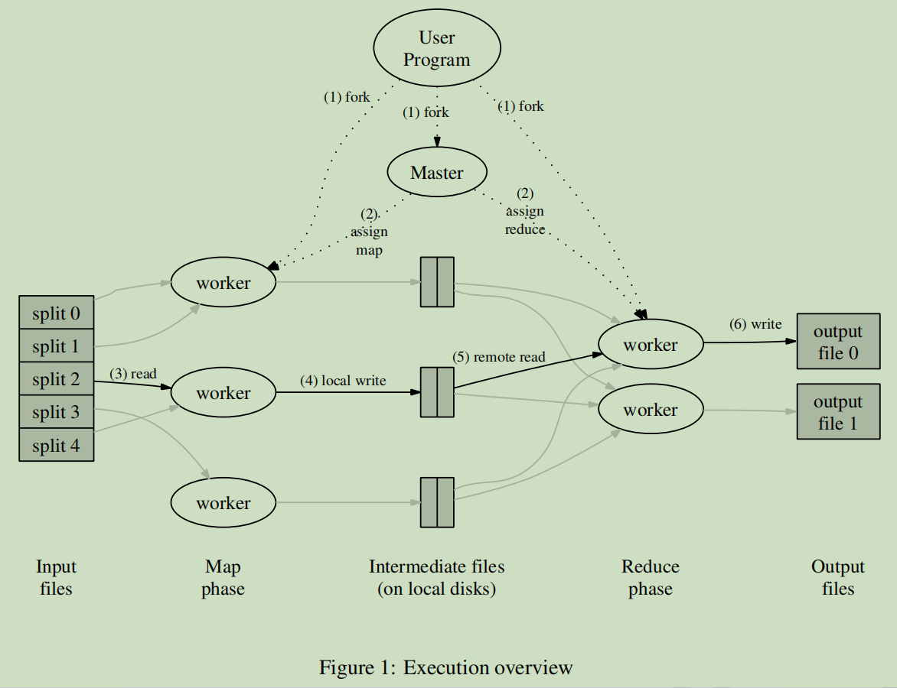
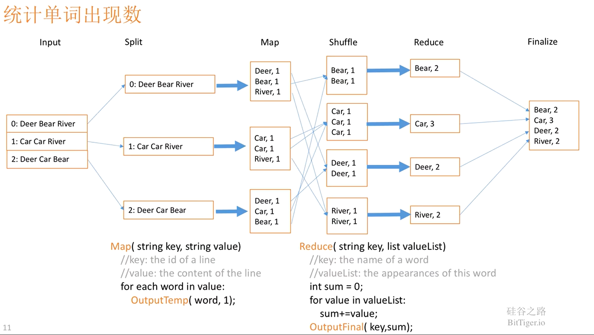

**1. `one-loop-per-thread`**

# 6.824分布式系统C++实现—————LAB1:MapReduce

## 首先需要学习

1、需要阅读的论文：[mapreduce.pdf](http://nil.csail.mit.edu/6.824/2020/papers/mapreduce.pdf)

2、需要clone的仓库: 
```shell
git clone git://g.csail.mit.edu/6.824-golabs-2020 6.824
```

- LAB官方基于go实现，但代码一些注释的细节，整体框架以及测试情况需要了解，还是要download仔细阅读
课程主页：`http://nil.csail.mit.edu/6.824/2020/labs/lab-mr.html`

- [深入浅出讲解 MapReduce_哔哩哔哩_bilibili](https://www.bilibili.com/video/BV1Vb411m7go?spm_id_from=333.851.header_right.fav_list.click)


## MapReduce基本框架




- MapReduce 是一种编程模型，用于大规模数据集的并行运算。在分布式系统的背景下，首先需要明确各个执行 `Map` 任务和 `Reduce` 任务的计算机是不知道彼此的存在，他们只负责处理给予的任务并写入文件系统，也无法确保任务是否能顺利完成，故除了执行任务的 `worker` 以外，需要一个协调所有 `worker` 的 `coordinator`。


- `coordinator` 需要分配所有的任务，map阶段将需要处理的文件分配给执行 `map` 的 `worker`; `reduce` 阶段类似. `coordinator` 还需实现状态的确认以及超时任务的重做（需要有定时任务处理），以确保任务阶段的变化以及失败任务的重新分发及处理。


- 在 `MapReduce` 中，`worker` 需要通过 `RPC-request` 向 `coordinator` 申请任务。因为 `worker` 之间互相不可知，`worker` 只负责处理交给自己的任务，而 `coordinator` 负责维护所有任务的状态，所以需要 `worker` 远程调用 `coordinator` 的 `AssignTask()` 方法，通过返回值取得任务。同理 `worker` 完成任务后，通过 `SetState()` 方法远程更新 `coordinator` 的状态信息。

## 词频统计的 mapreduce 流程图



## 定时任务

针对master需要实现任务的超时重分配，需要实现简单的定时任务，C++中常用的简单的定时方式有

- 1、在当前进程中再开一个线程进行定时，并以join()方式回收定时子线程，并CheckState检查任务状态。

```c++
/// @brief 分配map任务的函数，RPC, called by MapWorker
/// @return std::string 返回待map的文件名
std::string Coordinator::AssignAMapTask() {
  if (IsMapDone()) return "empty";
  if (!map_task_queue_.empty()) {
    std::unique_lock<std::mutex> lock(mutex_);
    std::string map_task =
        map_task_queue_.front();  //从工作队列取出一个待map的文件名
    map_task_queue_.pop();
    lock.unlock();
    //开启一个计时线程，若超时后仍未完成map任务，将该任务重新加入工作队列
    std::thread t([this, map_task]() { this->WaitMapTask(map_task); });
    t.detach();
    return map_task;
  }
  return "empty";
}

void Coordinator::WaitMapTask(const std::string& map_task) {
  //等待一个超时时间MAP_TASK_TIMEOUT
  std::thread tid([]() { ::sleep(MAP_TASK_TIMEOUT); });
  tid.join();  // join方式回收实现超时后解除阻塞

  std::lock_guard<std::mutex> lock(mutex_);
  //若超时后在对应的hashmap中没有该map任务完成的记录，重新将该任务加入工作队列
  if (finished_map_task_.count(map_task) == 0) {
    printf("map task : %s is timeout\n", map_task.c_str());
    map_task_queue_.push(map_task);
    return;
  }
}

```

- 2、使用条件变量cond_.wait_for()进行定时，这种方式优于上面那种sleep的方式。线程是一种宝贵的资源，创建一个线程啥也不干只sleep()，是不好的编程实践。

```c++
/// @brief 分配map任务的函数，RPC, called by MapWorker
/// @return std::string 返回待map的文件名
std::string Coordinator::AssignAMapTask() {
  if (IsMapDone()) return "empty";
  if (!map_task_queue_.empty()) {
    std::unique_lock<std::mutex> lock(mutex_);
    std::string map_task =
        map_task_queue_.front();  //从工作队列取出一个待map的文件名
    map_task_queue_.pop();
    lock.unlock();
    //开启一个计时线程，若超时后仍未完成map任务，将该任务重新加入工作队列
    std::thread t([this, map_task]() { this->WaitMapTask(map_task); });
    t.detach();
    return map_task;
  }
  return "empty";
}

void Coordinator::WaitMapTask(const std::string& map_task) {
  std::unique_lock<std::mutex> lock(mutex_);
  if(map_cond_.wait_for(lock, std::chrono::seconds(MAP_TASK_TIMEOUT),
                 [this, &map_task] { return this->finished_map_task_.count(map_task) > 0; })) {
    // 该任务已完成，不做任何事情
  } else {
    // 超时，重新加入队列
    printf("map task : %s is timeout\n", map_task.c_str());
    map_task_queue_.push(map_task);
  }
}
```

## 其他

每个函数的输入输出的kv分别具有不同的含义，具体可以看我写的代码注释，Lab1的注释是我写的最详细具体的，直接看代码也很容易明白。
